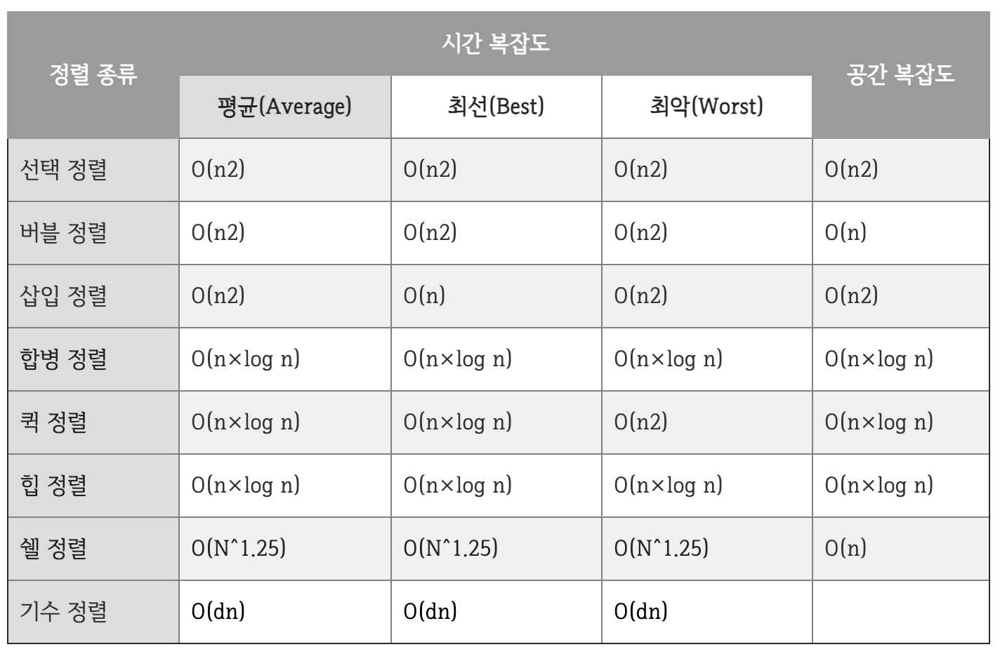
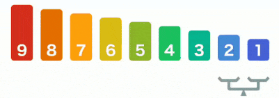

# Sort | 정렬
데이터를 특정한 기준에 따라서 순서대로 나열하는 것

 

# Sort 종류
- [버블 정렬(Bubble Sort)](#bubble-sort--버블-정렬)
- [선택 정렬(Selection Sort)](#selection-sort--선택-정렬)
- [삽입 정렬(Insertion Sort)](#insertion-sort--삽입-정렬)
- [퀵 정렬(Quick Sort)](#quick-sort--퀵-정렬)
- [병합 정렬(Merge Sort)](#merge-sort--병합-정렬)

- [Time Sort](#Time-Sort)

 

## Bubble Sort | 버블 정렬
시간복잡도 : O(N2)  

- 배열의 처음부터 끝까지 두 수(a, b)를 선택한 뒤 정렬되어 있지 않으면 두 수의 위치를 변경한다.

 

## Selection Sort | 선택 정렬
시간복잡도 : O(N2)

- 정렬되지 않은 데이터 중 가장 작은(큰) 수를 정렬된 수들 가장 뒤에 붙여가며 정렬한다.

 

## Insertion Sort | 삽입 정렬
시간복잡도 : O(N2), Ω(N)

- **맨 처음 데이터와 정렬할 차례가 된 수의 앞은 항상 정렬**되어 있다고 가정하고 시작한다.  
- 데이터를 순서대로 방문하며 앞의 수가 본인보다 작을 때까지 앞 숫자와 순서를 바꾼다.

 

## Quick Sort | 퀵 정렬
시간복잡도 : O(N2), Ω(NlogN)
- 최악의 시간복잡도 O(N2)는 내림차순이나 올림차순으로 이미 정렬이 되어 있는 경우 발생
- 피벗 수를 하나 특정하여 정렬되지 않은 수들 중 **피벗보다 작은 숫자를 왼쪽**에서 부터 찾고 **피벗보다 큰 수를 오른쪽**에서 부터 찾는다.
 

 

## Merge Sort | 병합 정렬
시간복잡도 : O(NlogN), Ω(NlogN)

  

## Time Sort
시간복잡도 : O(NlogN), Ω(N)
Python의 'sort', 'sorted' 함수의 정렬 알고리즘이다.

  

**출처**
*시간복잡도 표 : https://velog.io/@jaeyunn_15*
*버블 정렬 : https://medium.datadriveninvestor.com/bubble-sort-in-javascript-298375020b29*
*선택 정렬 : https://burning-camp.tistory.com/89*
*삽입 정렬 : https://thinkdiff.net/insertion-sort-swift-db14b9a79016*
*퀵 정렬 : https://velog.io/@yun8565*
*합병 정렬 : https://velog.io/@yun8565*