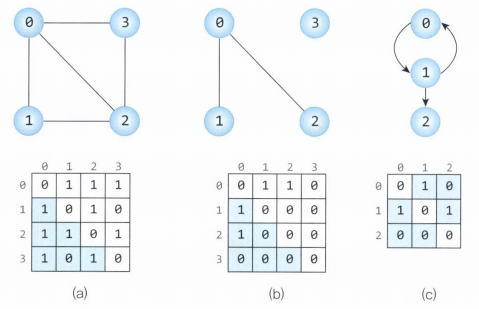
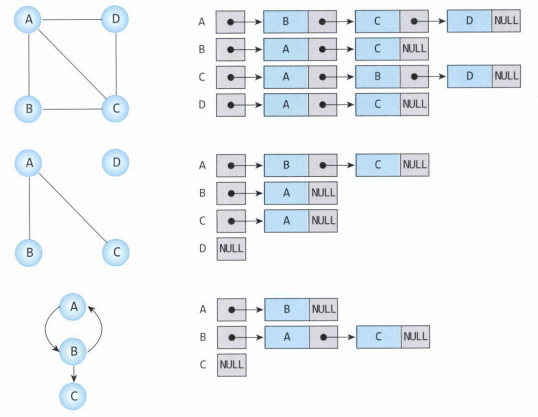

# Graph
**"정점(node)과 정점들을 연결하는 간선(edge)으로 구성된 자료구조"**  
[Tree(트리)](./Tree.md) 자료구조는 그래프에 속한다.

 

*교내 알고리즘 교재 chapter 15 참고*

## Graph 구성
정점(node, vertex) : 값을 가지는 단위  
간선(link, edge) : node와 node 사이를 잇는 연결자  
가중치(weight) : 간선의 가중치를 의미한다.  
방향(direction) : 간선의 방향을 의미한다.

## Graph 용어
루프(Loop) : 자신의 출발 node가 도착 node로 동일하게 연결된 간선  
경로(Path) : 특정 node Vi로부터 또다른 node Vj까지의 경로를 나타낸 것   
단순 경로(Simple Path) : 모두 다른 node로 구성된 경로  
사이클(Cycle) : 단순 경로의 시작 node와 마지막 node가 같은 경로

## Graph 종류

|            그래프             |            설명            |
|:--------------------------:|:------------------------:|
| 무방향 그래프(Undirected Graph)  |      간선에 방향이 없는 그래프      |
|   방향 그래프(directed Graph)   |      간선에 방향이 있는 그래프      |
|    가중 그래프(Weight Graph)    |     간선에 가중이 포함된 그래프      |
|      유향 비순환 그래프(DAG)       |   방향이 있으면서 순환하지 않는 그래프   |
|   완전 그래프(Complete Graph)   | 어떤 정점도 모든 다른 정점과 연결된 그래프 |
|  연결 그래프(connected Graph)   |    떨어져 있는 정점이 없는 그래프     |
| 단절 그래프(Disconnected Graph) |    연결되지 않은 정점이 있는 그래프    |

 

> - 각 그래프는 여러 특징을 가질 수 있다  
> - **유향 비순환 그래프**(DAG, Directed Acyclic Graph) 는 트리 자료구조로 표현될 수 있다.

 

## Graph 표현 방법

### 인접 행렬 (Adjacency Matrix)
- 행렬로 인접한 그래프를 표현한 것  
- N개의 node가 있다면 N^N 행렬로 표현됨
- 예를 들어 Graph[0][1]는 정점 0과 정점 1의 간선을 의미한다.
- 가중 그래프라면 각 가중치를 해당 행렬에 저장한다.  
   그렇지 않다면 T/F(1/0)로 연결 여부 저장 가능
- 그림에서 알 수 있듯이 인접 행렬의 우하향 대각선은 항상 0이다.

### 인접 리스트 (Adjacency List)

- 각 node의 인접을 list 형식으로 표현함
- 특정 노드에 대해 인접해있는지 확인하려면 리스트를 돌아봐야 한다.
   그렇기 때문에 인접 행렬보다 해당 수행에 대해서 시간이 더 걸림
- 인접하지 않은 node의 정보는 저장하지 않기 때문에 메모리적으로 효율적

 
 

*이미지 출처 : https://suyeon96.tistory.com/*