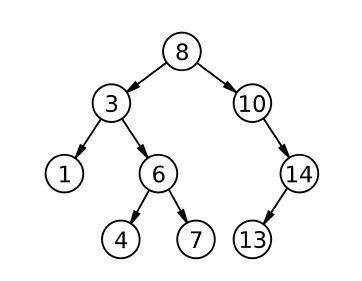

# Tree | 트리
그래프(Graph)에 속하며 **유향 비순환 그래프** (DAG, Directed Acyclic Graph)라고도 불림  

 

# Tree 용어

- 정점(node) : 정보의 단위로서 어떠한 정보를 가지고 있는 개체
- 루트 노드(root node) : 가장 최상위에 위치한 노드
- 단말 노드(leaf node) : 트리에서 가장 낮은 레벨에 위치한 노드
- 부모(parent) : 위로 연결된 있는 노드  
- 자식(child(ren)) : 아래로 연결된 노드  
 
- 조상(ancestor) : 자신을 제외한 root까지의 모든 부모 노드
- 후손(descendant) : 자신으로부터 모든 자식 노드
- 형제(sibling) : 같은 부모 노드를 가지는 노드  
 

- 노드의 깊이(depth) : 해당 노드로부터 root 노드까지 길이
- 노드의 차수(degree) : 해당 노드의 자식 수
- 노드의 레벨(level) :  같은 깊이를 갖고 있는 노드들. **깊이+1 level** 로 표현  
 

- 트리의 차수 : 트리의 모든 노드 중 가장 큰 차수
- 트리의 높이 : 리프 노드의 깊이

 

# Tree 종류

## 이진 트리
모든 노드의 자식 노드가 2개를 초과하지 않는 트리 구조

- ⭐️힙(heap)
- 완전 이진 트리(Complete Binary Tree)
- 정 이진 트리(Full Binary Tree)
- 포화 이진 트리(Perfect Binary Tree)

 

## 이진 탐색 트리
이진 탐색 동작을 할 수 있도록 고안된 자료구조
- 부모 노드보다 왼쪽 자식 노드가 작다
- 부모 노드보다 오른쪽 자식 노드가 크다
- 즉 **왼쪽 자식 노드 < 부모 노드 < 오른쪽 자식노드**를 만족함

   
**참고**  
*<이것이 취업을 위한 코딩테스트다 with Python> Chapter 7*  
*알고리즘 강의 Chap10*