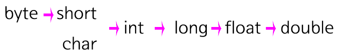

# 다형성 | Polymorphism
하나의 객체가 다양한 타입으로 변경가능한 OOP의 특징  
[오버로딩](#오버로딩--Overloading), [오버라이딩](#오버라이딩--Overriding), [형변환](#형변환--implicit-Conversion)이 대표적이다.


[🔖 블로그 정리 글](https://seen-young.tistory.com/65)

<br>

## 오버로딩 | Overloading
동일한 메소드명을 매개변수를 달리하여 작성하는 것

``` JAVA
	public static class Car {
		int wheel;
		
		Car(){
			this.wheel = 4;
		}
		
		Car(int wheel){
			this.wheel = wheel;
		}
		
		public void horn() {
			System.out.println("기본 차 경적 소리");
		}
	}
```

<br>

## 오버라이딩 | Overriding
하위 클래스에서 상위 클래스의 메소드를 재정의 하는 것
``` JAVA
	public static class Car {
		int wheel;
		
		Car(){
			this.wheel = 4;
		}
		
		Car(int wheel){
			this.wheel = wheel;
		}
		
		public void horn() {
			System.out.println("기본 차 경적 소리");
		}
	}

	public static class Truck extends Car {
		int truck_bed = 10;
		
		public void horn() {
			System.out.println("트럭 경적 소리");
		}
	}
```


<br>

## 형변환 | implicit Conversion
**표현 범위가 작은 타입 -> 표현 범위가 큰 타입으로만 형변형이 가능**하다.

<br>

### (암시적 형변환) 자동 형변환 | Promotion
사용자가 의도적 타입 변경을 하지 않아도 알맞게 타입을 변경해주는 기능  
자바에서는 데이터 손상없이 안전하게 변환이 가능하다.
<br>


*short 타입은 int 타입이 될 수 있지만, int 타입은 short 타입이 될 수 없다.*

<br>

``` txt
[ 한 걸음 더 ]
- JAVA의 소수 저장 기본 타입은 Double이다.
- **0.1F + 0.2F == 1.3** 해당 연산 결과는 **False**
  - 0.1 같이 이진수로 표현하여 순한소수가 되는 것은 Float로 저장시 누락되는 수가 많아 오차범위가 커지기 때문
```
  
<br><br>

### (명시적 형변환) 강제 형변환 | Casting
사용자가 지정한 타입으로 해당 변수 타입을 강제 변환하는 것  
ex. (int)3.5 수행시 해당 결과 값은 3이된다.

객체 참조 변수의 형변환은 강제 형변환에 포함되는 개념이다.

<br>

#### 객체 참조 변수 형변환
- 다운캐스팅(Downcasting) : 상위 클래스 타입을 하위 클래스 타입으로 변경
- 업캐스팅(Upcasting) : 하위 클래스 타입을 상위 클래스 타입으로 변경

``` JAVA
		// 기본 형태
		Car car1 = new Car();
		Truck car2 = new Truck();
```
```
		// IS-A 관계
		Car car1 = new Truck();  // 가능
		Truck car2 = new Car();  // 신텍스 에러
```
```
		// 다운캐스팅 불가능한 경우
		Car car1 = new Car();
		Truck car2 = (Truck)car1;  // 런타임 에러
```
```
		// 다운캐스팅
		Car car1 = new Truck();
		System.out.println(car1.truck_bed);  // 신텍스 에러

		Truck car2 = (Truck)car1;
		System.out.println(car2.wheel);  // 4
		System.out.println(car2.truck_bed);  // 10
```
```
		// 업캐스팅
		Truck car1 = new Truck();
		car1.wheel = 6;

		System.out.println(car1.wheel);  // 6
		System.out.println(car1.truck_bed);  // 10

		Car car2 = (Car)car1;

		car2.horn();  // 트럭 경적 소리
		System.out.println(car2.wheel); // 6
		System.out.println(car2.truck_bed);  // 신텍스 에러
```

